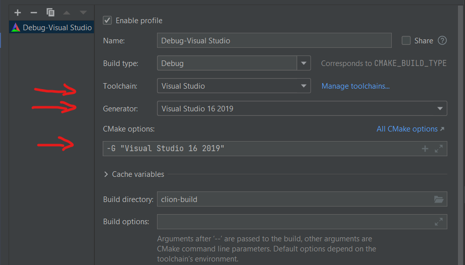
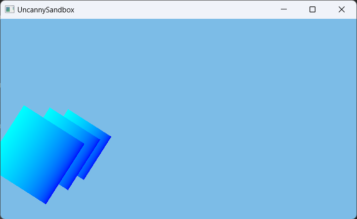

# UncannyEngine

Ongoing project, which I will use to learn Vulkan along with DearImGui.
Furthermore, I want to try implement ray tracing in future releases.

Build system: cmake

Used IDE: CLion and Visual Studio Code

Compiler: MSVC 19.29.30146.0

Generator: Visual Studio 16 2019

## Build

For compilation, you should have Visual Studio installed! UncannyEngine is a library imported by UncannySandbox.
UncannyEngine uses CMake build system.

For its proper work you should have VulkanSDK installed in first proposed
directory. In my case it is default path set by Vulkan Installer *C:\VulkanSDK\1.3.231.1*.
If you have installed Vulkan in other directory please add below line to main CMakeLists.txt file before
find_package(Vulkan):

```cmake
set(ENV{VULKAN_SDK} "<PATH_TO_VULKAN_SDK>")

#Example:
set(ENV{VULKAN_SDK} "D:/SDKs/Vulkan/Vulkan_1.3.126.0")
find_package( Vulkan REQUIRED )
```

Create *build* directory and run in it cmake command:

```bash
mkdir build
cd build
cmake -G "Visual Studio 16 2019" -A x64 ..
```

Now you should open generated .sln file at *build* directory and there compile the whole solution. Now you can go to
*build\Sandbox\Debug* directory, where you will find compiled .exe file.

**Please note that all  paths to resources like shaders, models etc. are stored along with compiled .exe file.
Currently, you won't be able to run anything from Visual Studio IDE.**

If you are using Clion you should set proper toolchain and generator, I have found Ninja generator to fail finding
VulkanSDK.

<p align="center">
  
</p>

## Images

UncannyEngine after running UncannySandbox 06.11.2022:

<p align="center">
  
</p>

## Author

Mateusz Rzeczyca

## History

23.09.2022 Changed directory structure for vulkan renderer, added graphics pipelines as separate structures, enabled updating uniform buffers during realtime (quads are rotating!) [tree](https://github.com/Mregussek/UncannyEngine/tree/ca783827f612787c6a9f741ddca847173e5aebac)

15.09.2022 Added depth buffer testing [tree](https://github.com/Mregussek/UncannyEngine/tree/15f421038d9e43888cf33ab389998af6be9983a0)

14.09.2022 Separated vulkan context from renderer, added resources for vulkan (image and buffers) and refactored code accordingly, added uniform buffers and checked usage of math library [tree](https://github.com/Mregussek/UncannyEngine/tree/94bc7b9b5bd0923bb5100e673b3846793862a1e2)

28.08.2022 Added index buffer, drawing a quad! [tree](https://github.com/Mregussek/UncannyEngine/tree/c6368d8cf7f02dd3ff31681c89484223453ec087)

28.08.2022 Added staging buffer for vertex data! [tree](https://github.com/Mregussek/UncannyEngine/tree/754b43268619131bc14fab726278598f2e3005a9)

28.08.2022 Rendering triangle with vertex buffer! [tree](https://github.com/Mregussek/UncannyEngine/tree/bf62523a37b0a4af7c6580fe2d45fb063d35fb23)

27.08.2022 Rendering first triangle! [tree](https://github.com/Mregussek/UncannyEngine/tree/25fbcd56292f56d41262c9bc9cd02a4450a88483)

27.08.2022 Added usage of transfer queue family, using transfer queues, cmd pools and buffers for copy image [tree](https://github.com/Mregussek/UncannyEngine/tree/eb39e1468d790c4c91a257300b7737f51db69f98)

26.08.2022 Copying render target into presentable is working! Added render pass and clearing screen with framebuffers [tree](https://github.com/Mregussek/UncannyEngine/tree/0147d1343fceb27527e046734fd5ee41fc94988e)

24.08.2022 Added copying render target image into presentable one along with refactoring, format validation [tree](https://github.com/Mregussek/UncannyEngine/tree/295f5cf22c8870677da0d7065e2d3e8d880a3e1c)

22.08.2022 Minimizing window is working properly [tree](https://github.com/Mregussek/UncannyEngine/tree/fa7adc5e0d8fc2c3b31545306a5fbec942b51606)

22.08.2022 Resolved issue during resizing with frames in flight, clearing is stable! [tree](https://github.com/Mregussek/UncannyEngine/tree/cfa00b9c0c286e6bf4edfb741e64ddce43e30cbd)

22.08.2022 Clearing screen with vkCmdClearColorImage with resizing made pretty stable [tree](https://github.com/Mregussek/UncannyEngine/tree/5fff1785a408d2839e26bc89e78152623433e80d)

11.08.2022 Resizing window is working [tree](https://github.com/Mregussek/UncannyEngine/tree/16ac43f74d5b142c6cd3aee21abf35130501a6fe)

11.08.2022 Clearing screen is working with vkCmdClearColorImage [tree](https://github.com/Mregussek/UncannyEngine/tree/3a75c1a14a187e0e75f51a2a607439b0a95d1a11)
