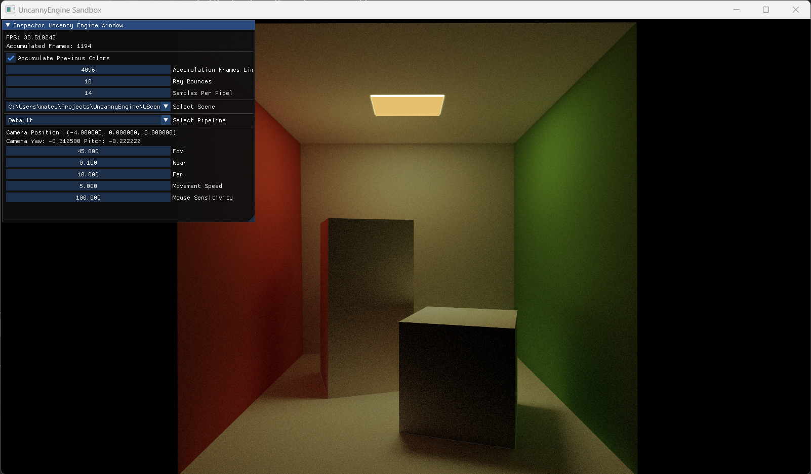

# UncannyEngine

Educational Vulkan-based 3D engine. Currently my primary focus includes acceleration structures, shader binding table,
ray tracing pipeline and its shaders.

### Samples

In USamples directory you can find all sample projects that are using UncannyEngine.
Every sample project name that I have created starts from xx number, for example: *06_RayTracingInSeveralBLASes*

Models are downloaded from Morgan McGuire's [Computer Graphics Archive](https://casual-effects.com/data)

### Current state

<p align="center">
  
</p>

<p align="center">
  
</p>

<p align="center">
  
</p>

<p align="center">
  
</p>

## Build

I am using CMake as a build system and MSVC as a compiler. Please use **Visual Studio 16 2019**! 

In order to build it you should use CMakeGUI and select project directory. In project directory please create
some build directory and mark it in GUI as follows.

<p align="center">
  
</p>

Next you can choose proper startup project, every sample project that I have created starts from xx number, for
example: *06_RayTracingInSeveralBLASes*

<p align="center">
  
</p>

Afterwards you can build project and you should running project :)

## Potential issues

Used version of ImGui may fail, when imgui.ini file is created in executable directory. It is related  to this issue
https://github.com/ocornut/imgui/issues/1817. This is why I have decided  to write special function that  deletes this
file, when engine is being released.

```cpp
void Application::DeleteImGuiIni()
{
  FPath imgui_ini = FPath::Append(FPath::GetExecutablePath(), "imgui.ini");
  FPath::Delete(imgui_ini);
}
```

So, if you are running sandbox sample or 12 imgui sample, make sure that imgui.ini is not already created and filled.
